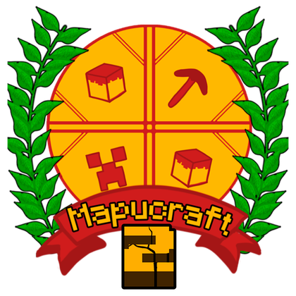
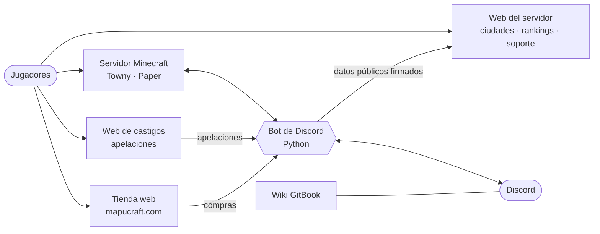

# Hola, soy Alberto 👋

**Estudiante · Desarrollador y administrador de [Mapucraft](https://mapucraft.com)**
Universidad del Bío-Bío (UBB) · Chile 🇨🇱

---

## 🧭 Sobre mí

- 🎮 Creo y administro **Mapucraft**, un servidor de Minecraft chileno con identidad mapuche (Towny, economía y comunidad; Java y Bedrock).
- 🛠️ Me encargo de todo el ecosistema: **servidor, bot de Discord, tienda, web de sanciones, wiki y web del servidor**, y de que hablen entre sí de forma segura.
- 📚 Estudio en la **Universidad del Bío-Bío** y publico aquí mis laboratorios y proyectos.
- 🔐 Me importa la seguridad: firmas HMAC entre servicios, límites de peticiones, antispam (Turnstile) y secretos fuera del código.

## 🧩 El ecosistema Mapucraft

| Pieza | Qué hace | Tecnología |
|---|---|---|
| 🤖 **Bot de Discord** | Tickets, apelaciones, niveles, ciudades de Towny, compras → roles, monitoreo de caídas, calendario | Python · discord.py · MySQL · SQLite |
| 🌐 **Web del servidor** | Ciudades, naciones, rankings, calendario, soporte y panel de staff con login de Discord | PHP 8 · OAuth2 · HMAC · Cloudflare Turnstile |
| 🔨 **Web de castigos** | Historial de sanciones (LiteBans) y apelaciones con código de seguimiento | PHP · MySQL |
| 🛒 **Tienda** | Rangos, llaves y MapuPoints con entrega automática | Node.js · Tebex |
| 📖 **Wiki** | Guías de Towny, economía, eventos y dungeons | GitBook · Markdown |
| ⚙️ **Servidor de juego** | Plugins a medida, Skript, MythicMobs, Oraxen, DiscordSRV | Java · Skript · YAML |

## 🧰 Tecnologías

## 📌 Proyectos públicos

| Repositorio | Descripción |
|---|---|
| [**mapu-wiki**](https://github.com/BetoCJ/mapu-wiki) | Wiki oficial de Mapucraft: Towny, economía, eventos y dungeons. |
| [**agenda-demo**](https://github.com/BetoCJ/agenda-demo) | Agenda de gestión (demo con datos ficticios): tareas por cliente y planta. |
| [**Labs-Tasks**](https://github.com/BetoCJ/Labs-Tasks) | Laboratorios y tareas de la carrera. |

> Los repositorios del bot, la tienda y la web de sanciones son privados porque incluyen la operación del servidor.

## 📊 GitHub

## 📫 Contacto

- 🎮 Sígueme en el juego: **`mapucraft.com`** (Java) · Bedrock `185.73.243.22:19132`
- 💬 Discord de la comunidad: <https://discord.gg/YDJKpgEU3m>
- 🛒 Tienda: <https://mapucraft.com> · 📖 Wiki: <https://mapu-1.gitbook.io/mapucraft>

Hecho con ☕ y mucho Minecraft · Chaltu may 💛

